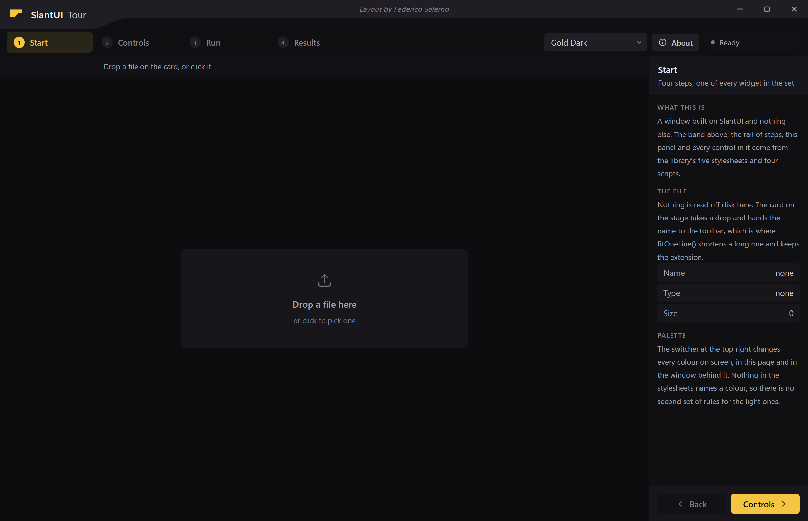
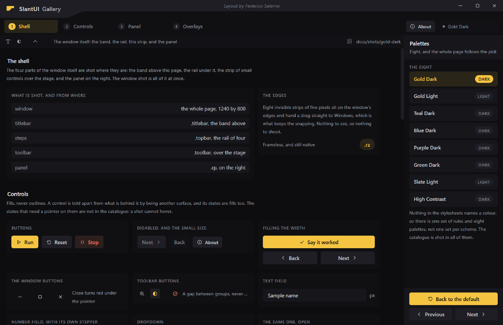

# Starting an application

Everything below is one window on screen, from an empty folder. The library
draws the frame, the title bar, the rail and the widget set; you write the
page inside them and the Python behind it.



*This is `examples/tour`, which is the finished version of what this page
builds. Open it beside you while you read: `.venv\Scripts\python
examples\tour\main.py`.*

## What it needs

Python 3.10 or later. The window is Windows only, because its frame is
answered in Win32 (see [the window](window.md)); the tokens, the stylesheets
and the exports run anywhere.

```bash
pip install -e ".[shell]"
```

The `shell` extra is PyQt6 with QtWebEngine, which only `slantui.shell`
imports. `slantui.tokens` has no dependencies at all, so a build step or a
hook can validate a palette on a machine with nothing installed.

## Four files

```
myapp/
  main.py          opens the window
  ui/index.html    the markup
  ui/app.css       your own rules, if you need any
  ui/app.js        your own script
```

`ui/` also ends up holding `slantui.css` and `slantui.js`, which `main.py`
writes there on every start. They are not yours to edit and they are not
worth committing.

### main.py

```python
import sys
from pathlib import Path

from slantui import css, js
from slantui.shell import Application, Bridge, Window, pyqtSignal, pyqtSlot

UI = Path(__file__).resolve().parent / "ui"


class Backend(Bridge):
    """Everything the page may ask of Python."""

    jobDone = pyqtSignal(str)

    @pyqtSlot(str, result=str)
    def greet(self, name):
        return "hello " + name


def main():
    (UI / "slantui.css").write_text(css.bundle(), encoding="utf-8")
    (UI / "slantui.js").write_text(js.bundle(), encoding="utf-8")

    app = Application("My App", app_id="Me.MyApp")
    win = Window(UI / "index.html", bridge=Backend(), title="My App",
                 size=(1280, 800), min_size=(1024, 640))
    win.show()
    return app.run()


if __name__ == "__main__":
    sys.exit(main())
```

Three things in there are worth a line each.

**`Application` is a `QApplication` that does four things before it exists**:
the taskbar identity (`app_id`, which is what gives your window its own icon
in the taskbar instead of Python's), the Chromium flags, the high DPI policy
and the WebEngine initialisation. Qt wants all four done in that order and
before the first widget, so they are done in a constructor and not left to a
comment in your file.

**The two `write_text` lines are how the page finds the library.** The window
loads the page from `file://`, so the page can only link what is on disk
beside it, and SlantUI lives wherever pip put it. `css.bundle()` is the five
stylesheets in load order as one string, `js.bundle()` the four scripts.
Writing them on every start means a change in the library shows up the next
time the window opens. An application that installs into a read only folder
writes them once at install time instead, into the same folder as the page.

**`Bridge` already carries the window chrome.** The six slots the title bar
calls are on it. Your subclass adds what your application does, and nothing
else.

### ui/index.html

```html
<!DOCTYPE html>
<html lang="en" data-palette="gold-dark">
<head>
<meta charset="UTF-8"/>
<title>My App</title>
<link rel="stylesheet" href="slantui.css"/>
<link rel="stylesheet" href="app.css"/>
</head>
<body>
<div class="app">

  <div class="titlebar">
    <div class="tbar-band"></div>
    <div class="tbar-brand">
      <span class="tbar-name"><b>My App</b></span>
    </div>
    <div class="tbar-drag"></div>
    <div class="tbar-btns">
      <div class="wbtn wbtn-min" title="Minimise">
        <svg viewBox="0 0 12 12"><line x1="2" y1="6" x2="10" y2="6"/></svg>
      </div>
      <div class="wbtn wbtn-max" title="Maximise">
        <svg viewBox="0 0 12 12"><rect x="2.5" y="2.5" width="7" height="7" rx="1"/></svg>
      </div>
      <div class="wbtn wbtn-close" title="Close">
        <svg viewBox="0 0 12 12"><line x1="3" y1="3" x2="9" y2="9"/><line x1="9" y1="3" x2="3" y2="9"/></svg>
      </div>
    </div>
  </div>

  <div class="work">
    <div class="main">
      <div class="stage">
        <button class="btn btn-1" id="hello">Say hello</button>
      </div>
    </div>
  </div>

</div>

<div class="rz rz-n"  data-edge="n"></div>
<div class="rz rz-s"  data-edge="s"></div>
<div class="rz rz-w"  data-edge="w"></div>
<div class="rz rz-e"  data-edge="e"></div>
<div class="rz rz-nw" data-edge="nw"></div>
<div class="rz rz-ne" data-edge="ne"></div>
<div class="rz rz-sw" data-edge="sw"></div>
<div class="rz rz-se" data-edge="se"></div>

<script src="qrc:///qtwebchannel/qwebchannel.js"></script>
<script src="slantui.js"></script>
<script src="app.js"></script>
</body>
</html>
```

That is the whole contract between a page and the window, and it is four
things:

1. **`data-palette` on `<html>`.** `palettes.css` keys on it. With none, the
   page draws in the default palette, which is `gold-dark`.
2. **A `.titlebar` block.** The window is frameless, so this is the title bar.
   `.tbar-band` is the element the band's shape is clipped onto, `.tbar-brand`
   holds the logo and the name and its measured width is where the band's
   taper starts, `.tbar-drag` is the rest of the bar, and `.tbar-btns` holds
   the three window buttons by their classes. You do not write a
   `.tbar-credit`: `titlebar.js` creates it and fills it, which is the
   licence's one condition.
3. **Eight `.rz` strips, anywhere in the body.** They are the resize edges.
   Each one hands its `data-edge` to Windows, so the resize is the system's
   own and keeps its cursors and its edge magnetism.
4. **`qwebchannel.js` before `slantui.js`.** Qt serves the first one out of
   its resources at that exact URL. Without it the bridge has no transport
   and the window buttons do nothing.

### ui/app.js

```javascript
Bridge.init();
initTitlebar();

document.getElementById('hello').onclick = function () {
  be('greet', 'world', function (answer) {
    console.log(answer);
  });
};
```

`Bridge.init()` connects the channel and `initTitlebar()` wires the band, the
buttons and the strips. Two calls, in that order, and the window is a window.

Then `be()` is the only way the page talks to Python:

```javascript
be('winDrag');                          // nothing to say, nothing back
be('runJob', 2400);                     // one argument
be('greet', 'world', function (s) {});  // an argument and an answer
beJson('appInfo', function (info) {});  // a slot that answers with JSON
Bridge.on('jobDone', function (text) {});   // a signal Python emits
```

The rule is the one JavaScript already has: a trailing function is the
callback and everything before it belongs to the slot. Calls made before the
channel is up are queued, and subscriptions made before it is up are connected
when it comes up, so no part of your page has to care about start up order. A
page that wants to hold the remote object itself asks for it with
`Bridge.whenReady(function (obj) { ... })`.

### ui/app.css

Most applications need a handful of rules, and some need none. The tour's own
sheet is three rules long. Whatever you write there is held to one rule:

```css
/* yes */
.my-panel { background: var(--surface-3); color: var(--text-2); }

/* no */
.my-panel { background: #1A1A20; color: #E6E6EC; }
```

A hex value in your sheet is correct on the palette you had open and wrong on
the other seven. See [the roles](roles.md) for the thirty names you may use
and what each one is for.

## Run it

```bash
.venv\Scripts\python main.py
```

If the window opens with a plain Windows title bar above your page, the page
is not loading `slantui.js`. If it opens frameless but the buttons do nothing,
`qwebchannel.js` is missing or `Bridge.init()` was never called. If it opens
with no colour at all, the stylesheets did not get written next to the page.

## What to put in it

The window has four parts, and the markup above uses two of them. All four are
in this picture, which is `docs/gallery.html` running:



- **`.titlebar`**, the band. One piece of chrome doing three jobs: the
  application's name, the licence line, and the window buttons.
- **`.topbar`**, the step rail. `.tabbar` on the left, `.tb-gap` between, then
  `.tb-r` for what belongs to the window instead of to the step.
- **`.toolbar`**, the strip over the work area, for what acts on the thing
  under it.
- **`.rp`**, the side panel. A header, a body that scrolls, and a footer that
  does not, so the buttons stay in one place on every step.

Those four and the `.stage` between them are the whole layout. They are classes
and not ids, so your page keeps its own ids and can hold two of anything.

The widget set that goes inside them is in the
[README](../README.md#the-widget-set), and every widget is a cell in
`docs/gallery.html`, which is the catalogue every picture in these pages comes
from.

## Shipping it

Your `requirements.txt` needs SlantUI in it:

```
slantui[shell]
```

and your installer has to get `slantui.css` and `slantui.js` next to the page.
Writing them at start, as `main.py` above does, is the simple answer and works
from a checkout and from an install. Writing them at install time is the
answer for an application that lands in a read only folder.

## Where to go next

- [The thirty one roles](roles.md), which is the vocabulary your stylesheet may use.
- [Palettes](palettes.md): the eight that ship, how to switch them, and how to
  build your own from five colours.
- [The window](window.md): what it does on Windows, and why it does it that way.
- [Outside a browser](beyond-the-browser.md), for a toolkit that cannot read a
  stylesheet.
- [examples/README.md](../examples/README.md), for the tour taken apart.
