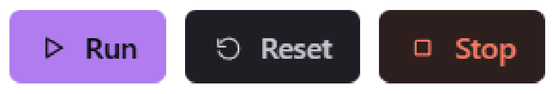
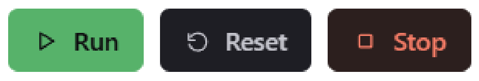
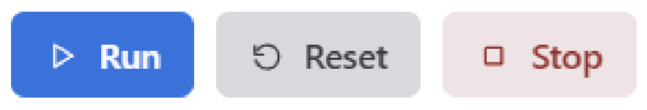
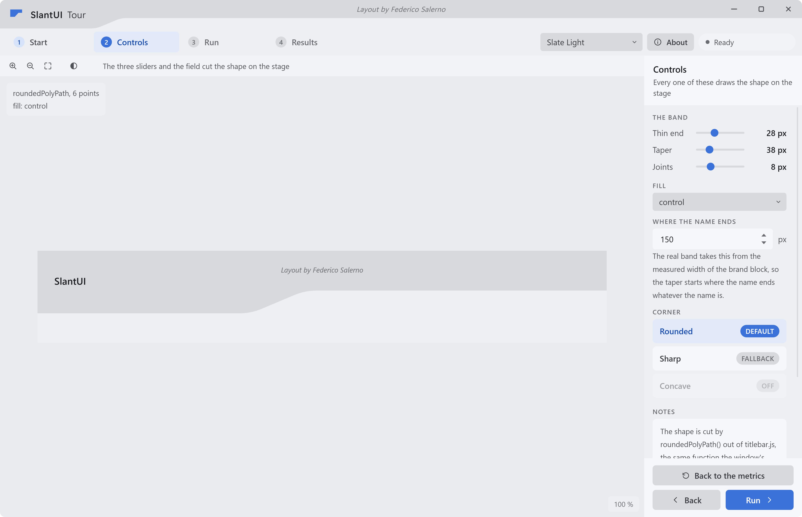
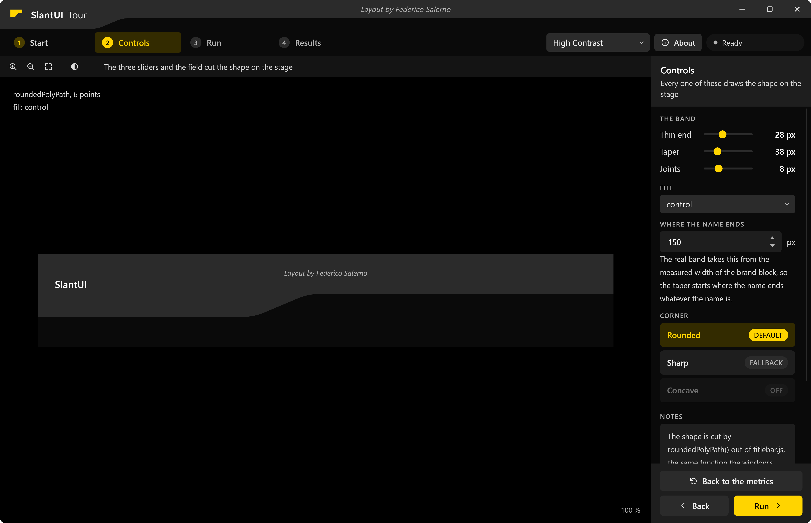

# Palettes

A palette is thirty one colours, one for each [role](roles.md). Eight ship with
the library, an application can switch between them at run time, and a ninth
takes five values and a line of Python.

Colour is the part of this design that is not the design. Gold on near black is
where it started, and the two level token system exists so that it is one
option out of many instead of the thing the components are written against.

## The eight

| Slug | Name | Scheme | What it is |
|---|---|---|---|
| `gold-dark` | Gold Dark | dark | The default. Gold on near black, and the palette the design was drawn in. |
| `gold-light` | Gold Light | light | The same gold on paper. Its surfaces and text are the ones a printed report uses. |
| `teal-dark` | Teal Dark | dark | Gold Dark with a teal accent in front. |
| `blue-dark` | Blue Dark | dark | Gold Dark with a blue accent in front. |
| `purple-dark` | Purple Dark | dark | Gold Dark with a purple accent in front. |
| `green-dark` | Green Dark | dark | Gold Dark with a green accent in front. The accent and the `ok` colour share a hue here, so read the shape and not the colour. |
| `slate-light` | Slate Light | light | Cool greys and a blue accent, for an application that should not look like the default. |
| `high-contrast` | High Contrast | dark | Pure black, pure white, saturated accents. Nothing in it is near a threshold. |

The same three buttons, with no rule written twice:

<table>
<tr>
<th align="center">Gold Dark</th>
<th align="center">Gold Light</th>
</tr>
<tr>
<td align="center" valign="middle">
<picture>
<source media="(prefers-color-scheme: dark)" srcset="img/gold-dark/buttons.png">

</picture>
</td>
<td align="center" valign="middle">

</td>
</tr>
<tr>
<th align="center">Teal Dark</th>
<th align="center">Blue Dark</th>
</tr>
<tr>
<td align="center" valign="middle">

</td>
<td align="center" valign="middle">

</td>
</tr>
<tr>
<th align="center">Purple Dark</th>
<th align="center">Green Dark</th>
</tr>
<tr>
<td align="center" valign="middle">

</td>
<td align="center" valign="middle">

</td>
</tr>
<tr>
<th align="center">Slate Light</th>
<th align="center">High Contrast</th>
</tr>
<tr>
<td align="center" valign="middle">

</td>
<td align="center" valign="middle">

</td>
</tr>
</table>

Four of them are written out in full in `slantui/tokens/palettes.py`, because a
design system you cannot read off the page is one nobody trusts. The other four
are the default with another accent hue, built by `with_accent` from the same
formulas the generator uses.

## Switching one

Three things have to agree: the page, the window behind it, and whatever the
page has already read.

```html
<html data-palette="slate-light">
```

`palettes.css` keys on that attribute, so setting it is the whole of the CSS
side. At run time:

```javascript
Theme.setPalette('slate-light');   // the attribute, and every value read again
be('setPalette', 'slate-light');   // your own slot, so the window follows
```

```python
@pyqtSlot(str)
def setPalette(self, slug):
    self.window.set_palette(slug)
```

The window needs telling because the colour behind the page belongs to it: it
is what the screen shows while the page loads and, during a live resize, in the
strip the page has not painted yet. On the wrong palette that strip flashes the
old shade on every drag of the window edge.

`set_palette` raises on a slug the library does not ship. A window that opens
on your own palette is handed the colour instead:

```python
win = Window(UI / "index.html", background="#101014")
```

Here is the same window on two of them. Same markup, same stylesheets, one
attribute apart:



*Slate Light.*



*High Contrast.*

## A palette from five values

```python
from slantui.tokens import derive

mine = derive(base="#0D0D0F", accent="#F5C542", text="#E6E6EC",
              ok="#57B26A", err="#B0524A",
              name="My App", slug="my-app")
```

Five values carry the intent and the other twenty six follow by formula:

- **`base`** is the window backdrop, and it decides whether the palette is dark
  or light. The four surfaces step away from it in OKLab lightness, and they
  step down instead of up when the base is already too light to have headroom.
- **`accent`** fills the seven accent roles. The fill, the tint and the text
  shade are solved separately, which is what makes an accent readable on a
  light palette.
- **`text`** is the brightest text. `text-2`, `text-3` and `text-4` are solved
  down from it against the contrast targets, holding its hue and its chroma, so
  the four steps are spaced by the contract and not by the seed.
- **`ok`** and **`err`** seed the status family. `warn` is `err` rotated to
  amber in OKLCH, and the three tinted surfaces come off the same rotation, so
  they land at one lightness.

A derived palette clears the audit by construction, because the solvers measure
with the same contrast function the auditor does. There is no second set of
rules to keep in agreement with the first.

Two decisions are baked into the formulas and are worth knowing before you are
surprised by them. A filled status indicator is always a deep colour with a
light label, on every palette, so that `ok`, `warn` and `err` read as one
family and one `on-status` serves all three; the lighter, more saturated
version of each hue is the separate `ok-text` role. And controls move away from
the page while surfaces rise, which on a light palette means controls get
darker and surfaces get lighter.

### A variant of one you already have

```python
from slantui.tokens import PALETTES

mine = PALETTES["gold-dark"].with_accent(
    "#3FBFB0", name="Teal Dark", slug="teal-dark")
```

The seven accent roles are rebuilt and the neutrals stay put. Four of the eight
shipped palettes are this call.

### Thirty one by hand

```python
from slantui.tokens import Palette

values = {"surface-0": "#0D0D0F", "surface-1": "#101013"}   # and the other 29
mine = Palette(name="My App", slug="my-app", scheme="dark", values=values)
```

A missing role, a name that is not a role, a value that is not a hex colour and
an alpha on a role that may not carry one are all refused at construction
instead of on screen. Then run the auditor, because nothing here is solved for
you.

`edit()` gives you the middle ground: a derived palette with a few values
replaced, validated again.

```python
mine = derive(...).edit(accent="#F5C542", scrim="#000000B8")
```

## Checking it

```bash
python -m slantui.tokens audit                 # every palette, every pair
python -m slantui.tokens audit gold-dark -v    # one, passes included
```

The exit code is 1 when anything falls short, so it stands on its own in a hook
or a CI step. For a palette of your own, in Python:

```python
from slantui.tokens import audit, failures, report

print(report([mine]))       # the summary, and every pair that falls short
short = failures(mine)      # the same pairs as Check records, worst first
rows = audit(mine)          # all 110, passing and failing alike
```

What to do when it fails depends on which pair failed. A text role short
against one surface is usually the surface: a control that sits too close to
the text it carries. A text role short against all of them is the text, and
`solve_text` will place it for you. An `on-accent` shortfall means the accent
fill is at a lightness where neither black nor white clears 4.5:1, which is a
sign the fill wants to be deeper or lighter, not that the floor wants moving.

## Putting it in a page

The library's own eight are in `palettes.css`, which `css.bundle()` writes into
`slantui.css`. Your palette goes after it, in your own sheet:

```python
from slantui.tokens.css import render

(UI / "app.css").write_text(render(mine), encoding="utf-8")
```

`render(mine)` is a `:root` block. `render(mine, selector='[data-palette="my-app"]')`
is the same block keyed on the attribute, which is what you want when the
application can switch between yours and the library's.

The load order is what makes this work: `app.css` comes after `slantui.css` in
the page's `<head>`, so your block wins for whatever it defines.

## Taking it somewhere else

Every palette, yours included, is written out for a toolkit that cannot read a
stylesheet:

```bash
python -m slantui.tokens json                  # the whole design as data
python -m slantui.tokens xaml gold-dark        # a WPF ResourceDictionary
python -m slantui.tokens ps1                   # a PowerShell data file
python -m slantui.tokens uss                   # Unity's UI Toolkit
```

See [outside a browser](beyond-the-browser.md), which also carries the band's
geometry, the metrics and the recipe for drawing the title bar in a toolkit
this library has never heard of.

## What to read next

- [The roles](roles.md), for what each of the thirty one values is for.
- [Starting an application](getting-started.md).
- [The window](window.md).
