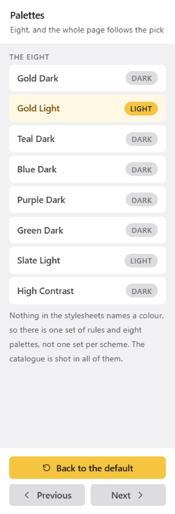
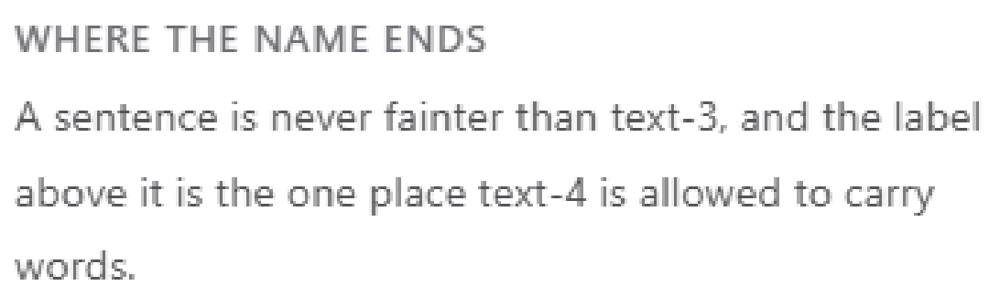
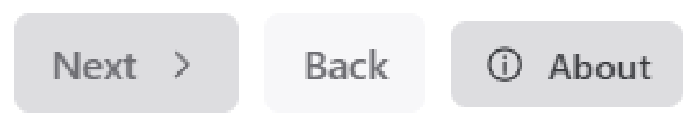
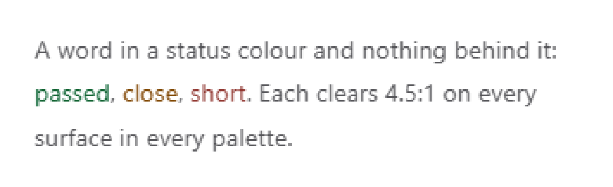
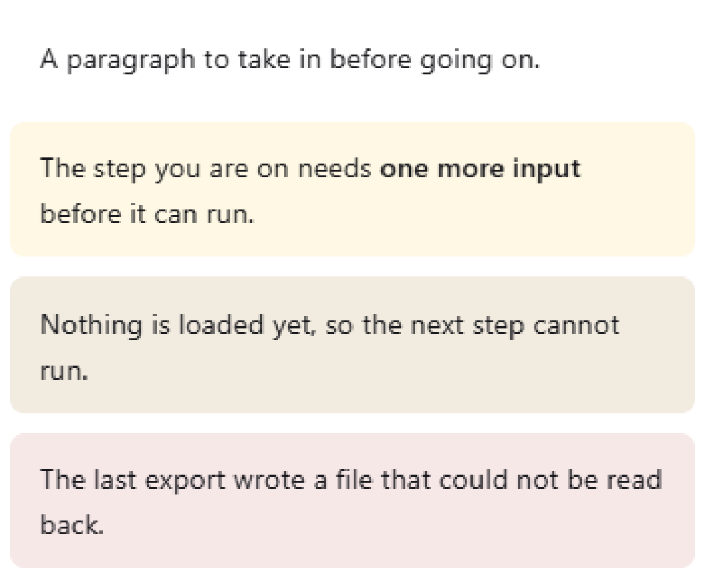
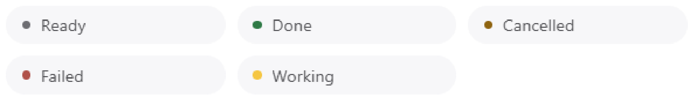
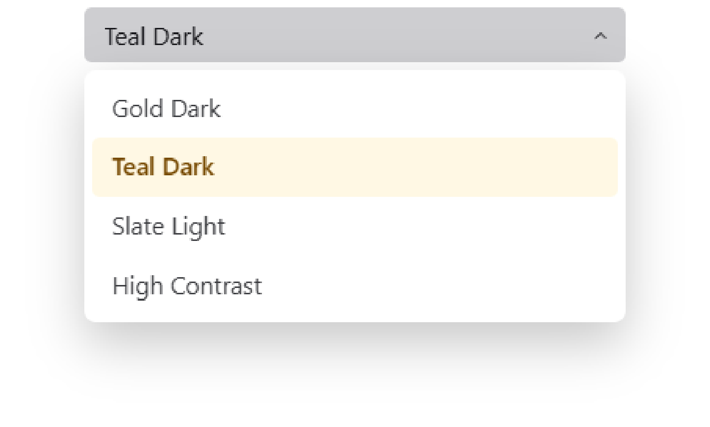

# The roles

A palette holds thirty one concrete colours. A role is the name a component is
allowed to use. Nothing in a stylesheet ever names a colour, which is the whole
reason one set of component rules is correct on a dark palette and on a light
one.

```css
.my-card { background: var(--surface-3); color: var(--text-2); }
```

The name says what the colour is for. It never says what the colour is, and it
never says which way the lightness goes. `surface-3` is the most raised
surface, which is lighter than the page on a dark palette and can be either on
a light one. A component that asks for `surface-3` is right on all eight
palettes without knowing which one is loaded.

That is why a name like `--panel2` or `--panel3` cannot survive into a
library. It encodes "raised means lighter", which is only true in the dark.

`slantui/tokens/roles.py` is the source of this page. `python -m slantui.tokens
roles` prints the same list with the contrast tiers on it.

## Two rules that come before the list

**Fills, never outlines.** A control is told apart from what is behind it by
being another surface, and its states are fills too. There is no border role
and no divider role, and the test suite fails on a solid border in the library
stylesheets. This is why there are three control roles and four surfaces: the
steps between them are the only thing drawing the edges.

**A role is the whole vocabulary.** The test suite fails on a hex value, an
`rgb()`, or a custom property that is neither a role nor a metric, in
`base.css`, `layout.css` and `components.css`. Your own sheet is held to the
same rule by hand, and it is worth holding, because a hex value is correct on
the palette you had open and wrong on the other seven.

## Surfaces

Four planes, by how far forward they sit. They get lighter as they rise, on
both schemes, which is what a sheet of paper does.

| Role | What it is | Where it is drawn |
|---|---|---|
| `surface-0` | The window backdrop, the plane everything sits on | `html`, `body`, `.stage` |
| `surface-1` | Bands fixed to the window edge | `.titlebar`, `.topbar`, `.rp` |
| `surface-2` | Strips and toolbars inside the work area | `.toolbar`, `.stpill` |
| `surface-3` | The most raised plane | `.card`, `.combopop`, `.input`, `.rp-hd`, `.rp-foot` |

<picture>
<source media="(prefers-color-scheme: dark)" srcset="img/gold-dark/panel.png">

</picture>

*The side panel is `surface-1`, its header and footer are `surface-3`, and the
controls in it are `control`. Four planes and no line between any of them.*

## Controls

Three fills for one control: at rest, under the pointer, and while it is
pressed. Controls move away from the page, which means lighter on a dark
palette and darker on a light one.

| Role | What it is | Where it is drawn |
|---|---|---|
| `control` | The resting fill of a secondary control | `.btn-2`, `.wbtn`, the slider track, the scrollbar thumb, `.tbar-band` |
| `control-hover` | The same control under the pointer | `.btn-2:hover`, `.combo:hover`, `.wbtn:hover` |
| `control-active` | The same control while it is pressed | `.btn-2:active` |

The band behind the title bar is `control` and not a surface, on purpose: it is
the one piece of chrome you are meant to be able to grab.

## Text

Four shades, brightest to faintest. They are a ladder solved against the
contrast function, so the gap between two of them is the same gap on every
palette.

| Role | What it is | Where it is drawn |
|---|---|---|
| `text-1` | Values, titles, the label on a hovered button | `.rp-title`, `.tbar-name b`, `.btn-2:hover` |
| `text-2` | Body copy, the label on a resting button | `.btn-2`, `.combo`, `.mitem-name` |
| `text-3` | Captions, row labels, units, hints | `.rp-sub`, `.note`, `.stpill`, `.tab.done` |
| `text-4` | The faintest allowed. Never a sentence | `.sec-lbl`, `.tbar-credit`, `.tab`, and every `:disabled` label |

<picture>
<source media="(prefers-color-scheme: dark)" srcset="img/gold-dark/labels.png">

</picture>

*`text-4` is the one role held to the lower contrast floor, and this is the
rule that comes with it: it labels a block, it never carries the sentence. A
paragraph in `text-4` is the one way to fail the audit with a palette that
passes.*

<picture>
<source media="(prefers-color-scheme: dark)" srcset="img/gold-dark/buttons-off.png">

</picture>

*Disabled is `text-4` on a flattened fill, for every kind of button. There is
no disabled role: a control that cannot be used is the faintest text on the
plainest surface it already has.*

## Accent

The one colour that marks the action moving the workflow forward. Seven roles,
because an accent is a fill, a text colour and a tint, and those are three
different colours on a light palette.

| Role | What it is | Where it is drawn |
|---|---|---|
| `accent` | The fill of the primary action | `.btn-primary`, the slider thumb, the active step's number |
| `accent-hover` | The accent fill under the pointer | `.btn-primary:hover` |
| `accent-active` | The accent fill while pressed | `.btn-primary:active`, the progress fill |
| `on-accent` | Text and glyphs on an accent fill | the label of `.btn-primary`, `::selection` |
| `accent-text` | The accent as a text colour, and the focus ring | `.tab.active`, `.input:focus`, `:focus-visible` |
| `accent-surface` | A surface tinted toward the accent | the active tab, the selected row, `.chip-accent`, `.callout-accent` |
| `accent-surface-hover` | The same tint under the pointer | the selected row hovered |

`accent-text` exists because a fill and a label are solved against different
things. On a light palette the fill stays the bright hue and the text becomes a
darker shade of it, or nothing written in the accent colour would be readable
on white.

<picture>
<source media="(prefers-color-scheme: dark)" srcset="img/gold-dark/tabs.png">

</picture>

## Status

Three states, and ten roles, because a status is a filled indicator in one
place and a word in another and a tinted note in a third.

| Role | What it is | Where it is drawn |
|---|---|---|
| `ok` | A filled indicator that something succeeded | the dot on the status pill |
| `warn` | A filled indicator that something needs attention | the same dot |
| `err` | A filled indicator that something failed | the same dot, `.wbtn-close:hover` |
| `on-status` | Text and glyphs on an `ok`, `warn` or `err` fill | the close button's glyph |
| `ok-text` | Success as a text colour, no fill behind it | `.text-ok` |
| `warn-text` | A warning as a text colour | `.text-warn`, `.chip-warn` |
| `err-text` | A failure as a text colour | `.text-err`, `.btn-danger`, `.chip-err` |
| `warn-surface` | A surface tinted toward `warn` | `.chip-warn`, `.callout-warn` |
| `err-surface` | A surface tinted toward `err` | `.btn-danger`, `.chip-err`, `.callout-err` |
| `err-surface-hover` | The same tint under the pointer | `.btn-danger:hover` |

The split between a fill and a text colour is the part worth knowing. A filled
indicator is always a deep colour with a light label, on every palette, so that
`ok`, `warn` and `err` read as one family and a single `on-status` serves all
three. The lighter, more saturated version of each hue is the separate role,
and that is what a six pixel dot or a red icon button uses.

<picture>
<source media="(prefers-color-scheme: dark)" srcset="img/gold-dark/status-words.png">

</picture>

*`ok-text`, `warn-text` and `err-text`, in a sentence, with no fill under them.*

<picture>
<source media="(prefers-color-scheme: dark)" srcset="img/gold-dark/callouts.png">

</picture>

*`accent-surface`, `warn-surface` and `err-surface`, as the three callouts. The
three tints sit at one lightness. `warn-surface` is `err-surface` turned to
amber in OKLCH for that reason: mixing a surface toward the `warn` fill instead
lands a good deal darker, because a deepened amber is darker than a deepened
red at the same strength, and three tints at three lightnesses read as a
mistake instead of as a family.*

<picture>
<source media="(prefers-color-scheme: dark)" srcset="img/gold-dark/status-pill.png">

</picture>

## Depth

The three that carry an alpha, because what is under them is not known.

| Role | What it is | Where it is drawn |
|---|---|---|
| `scrim` | Covers the work area while the application is busy | `.scrim` |
| `shadow` | The colour a popup casts, inside a `box-shadow` | `.combopop` |
| `overlay` | A plate over content of an unknown colour | the label over the stage, the zoom pill |

The auditor holds two of them to a floor that is not about contrast. A scrim
that does not dim is not a scrim (alpha at least 0.60), and a shadow that is
opaque is a rectangle (alpha at most 0.95).

<picture>
<source media="(prefers-color-scheme: dark)" srcset="img/gold-dark/dropdown-open.png">

</picture>

*`shadow`, cast by the popup. The picture carries it as the window drew it,
fading into the page this page is on, because a picture here has no background
of its own either.*

## Core and extended

Twenty one of the thirty one are the core vocabulary. The other ten cover what
the core cannot express, and every one of them was added because a real widget
needed it:

```
accent-text  accent-surface  accent-surface-hover
on-status  ok-text  warn-text  err-text
warn-surface  err-surface  err-surface-hover
```

`warn-surface` is the newest of them. The palette had a fill and a text shade
for all three statuses and a tinted surface for two, and the missing one was
the caution fill, which is what a note that stops the reader before they go on
is drawn on.

## The contrast contract

Every text role is measured against every surface it is allowed to land on, on
every palette. That is 110 pairs per palette and 880 in total, and the test
suite fails on one shortfall.

| Tier | Roles | Floor |
|---|---|---|
| body | `text-1` `text-2` `text-3` and the four hue foregrounds | 4.5:1 |
| minor | `text-4`, which is barred from carrying a sentence | 3.0:1 |
| on-fill | `on-accent` on the accent fills, `on-status` on the status fills | 4.5:1 |

The floors were fixed before any palette was written, so that a palette is
never the argument for lowering one. Three of the colours this design shipped
with did not clear them, and the colours moved, not the floors.

```bash
python -m slantui.tokens audit                 # every palette, exits 1 on a shortfall
python -m slantui.tokens audit gold-dark -v    # one palette, passes included
```

`overlay` is in the list of surfaces text may land on, because text really is
drawn on it. It carries an alpha, so the auditor composites it over black and
over white and scores the worse of the two.

## Reading the roles back in a page

A canvas, a WebGL material or an SVG generated in JavaScript needs the value
and not the name. `theme.js` reads them off `:root`:

```javascript
Theme.read();                        // all thirty one, keyed by role name
Theme.get('surface-0');              // one value, as of the last read
Theme.read(['tbar-h', 'accent']);    // a metric and a role, in one call
```

The names carry no dashes, and `get` only answers for a name something has
read. `Theme.setPalette(slug)` switches palette and reads every name again, so
code that asks after it sees the new colours.

This is also how a page reads a metric, which is what
[the window](window.md) and `examples/tour` do to draw the title bar's own
profile on the stage.

## What to read next

- [Palettes](palettes.md): the eight that ship, and how to fill these roles
  with your own colours.
- [Starting an application](getting-started.md), if you got here first.
- [Outside a browser](beyond-the-browser.md), for the same roles in WPF, in
  Unity or as plain data.
