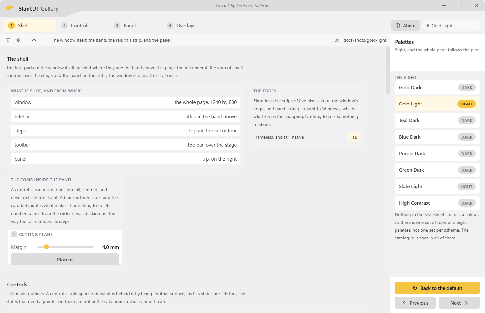
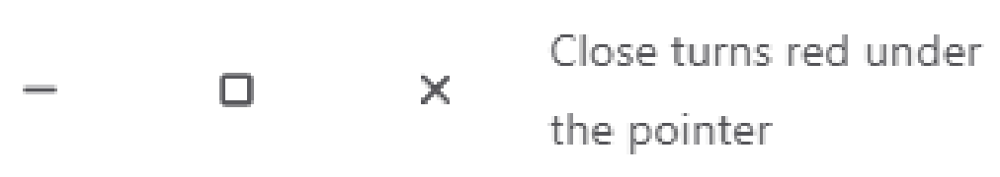
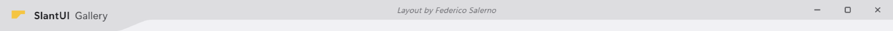

# The window

The look needs a frameless window, because the title bar is drawn by the page.
A frameless window on Windows loses the things nobody notices until they are
gone: the slide out of the taskbar, Aero Snap, the drop shadow, the rounded
corners. This page is what the library does to keep all of them, and what your
application has to do about it, which is mostly nothing.

<picture>
<source media="(prefers-color-scheme: dark)" srcset="img/gold-dark/window.png">

</picture>

## Frameless, with a real frame

Qt's frameless window is a bare `WS_POPUP`, and Windows animates minimise,
restore, maximise and close only for windows that carry a real frame. Without
one, the window snapped in and out of the taskbar instead of sliding.

So the library does what Chromium and VS Code do:

1. Keep Qt's frameless hint, so Qt reports zero frame margins and lays the page
   out over the whole window.
2. Give the HWND the frame styles anyway: `WS_CAPTION | WS_THICKFRAME |
   WS_MINIMIZEBOX | WS_MAXIMIZEBOX | WS_SYSMENU`.
3. Answer `WM_NCCALCSIZE` with "the client area is the whole window", which
   takes the caption and the borders off again while the styles, and with them
   the animations, the DWM shadow and Aero Snap, stay.

`WM_NCACTIVATE` is answered as well, with `lParam` set to -1, which is the
documented way to say "do not repaint the caption". That is the one place a one
pixel caption line could still show, on a change of focus.

Two DWM attributes finish it. A framed window gets rounded corners for free and
a frameless one has to ask, or it is the only square window on the desktop. And
Windows 11 draws a light hairline around every window, which this design does
not want anywhere, so the DWM is told to draw none. Older Windows refuse both
attributes and nothing else depends on them.

All of it is in `slantui/shell/win32.py`, which takes a window handle as a
plain integer and does nothing at all off Windows.

## The window never zooms

This is the one departure from the code the look came out of, and it is the
part worth reading before changing anything.

Maximised is a state of the `Window` class, not of the HWND. Maximised means a
normal window animated onto the work area that reports itself maximised to the
page. Windows is never asked to zoom it.

The reason is the frame styles above. When Windows zooms a window that carries
them, it places it with the frame past the edge of the screen, eleven pixels on
every side at 150 %, and it keeps it there. For a window whose client area is
the whole window, that is eleven pixels of page cut off on all four sides.
Everything that might move it back was tried and measured: `WM_GETMINMAXINFO`
answered with the work area, `SetWindowPos` on the zoomed window, dropping
`WS_THICKFRAME` first. Windows proposes the right rectangle and then places the
framed one anyway.

Up to Qt 6.11.1 nobody met this, because Qt maximised a frameless window by
moving it onto the work area itself and never zoomed the HWND. Qt 6.11.2
(QTBUG-145092, picked back to 6.8) removed that special case and zooms a
frameless window like any other.

So the window maximises itself, and the three paths by which Windows would zoom
it anyway are covered:

- **Win+Up and the taskbar menu** arrive as `WM_SYSCOMMAND` and are routed to
  the window's own maximise, restore and minimise.
- **A drag to the top edge** zooms without asking, and that zoom is undone the
  moment Qt reports it.
- **A drag on the band of a maximised window** restores it under the cursor
  first, as Windows does, so the window follows the pointer instead of jumping.

## What it animates, and what Windows animates

Windows' own state transitions scale a snapshot of the last frame over a fixed
curve, which for a window like this one showed up as a jump. The window
animates its own geometry instead, over 240 ms, and the content is laid out and
drawn at every intermediate size. The DWM transition is switched off only
around the state change itself, so nothing animates twice.

Moving and resizing are the opposite: they are handed straight back to the
window manager, through `startSystemMove` and `startSystemResize`. That is what
keeps snapping, edge magnetism, the shadow, the resize cursors and the double
click on the band. The page never implements any of it; it says which edge was
grabbed and Windows does the rest.

### An animation a heavy window is allowed to skip

Animating a window's geometry costs whatever it costs to lay the content out,
and that is not the library's to decide. Measured on 2026-09-20, on a WPF
window with a hundred and twenty paragraphs of wrapping text under it: one step
of a resize costs **78 ms**, because WPF lays the whole tree out inside the size
message. Two hundred and forty milliseconds of hand animation over that is
three visible steps, and three steps read worse than no animation at all.

So the move measures itself. Each frame is timed, and two frames running slower
than `SlowMs` (40 ms, which is under thirty a second) end the animation and put
the window where it was going. A light window gets the curve; a heavy one gets
a clean snap instead of a stutter. Nothing has to be configured for this.

Two smaller things came out of the same measurement, and both are in the WPF
module:

- **one call, not four.** Writing `Left`, `Top`, `Width` and `Height` on a WPF
  window is four calls into Windows and four layout passes. `Place` is one
  `SetWindowPos` with all four numbers, which on an empty window costs 8.3 ms
  against 10.4, and, the part that matters more, is *atomic*: there is no frame
  in which the window is already the new size and still at the old position;
- **the frame clock, not a timer.** A `DispatcherTimer` asked for 16 ms queues
  behind layout and input at the same priority. Over 361 ms of a live resize it
  delivered 9 ticks where the compositor composed 14 frames. `CompositionTarget.Rendering`
  is raised once per composed frame, right before it goes out.

### A gesture the application is told about

Windows runs a modal loop while a window is dragged by an edge, and every pixel
of it is a `WM_SIZE`. An application that reflows text on each one is doing the
most expensive thing it owns, sixty times a second, for a layout nobody is
reading yet: the words go round under the hand.

The window procedure answers `WM_ENTERSIZEMOVE` and `WM_EXITSIZEMOVE` and hands
the two ends of the gesture to the application, and the library raises the same
signal around a state change it animates, because to an application a maximise
and a drag of an edge are the same thing:

```powershell
$chrome.OnSizing = { param($active) $view.FreezeText($active) }
```

What to do with it is the application's, and the useful thing is small: give
the panels that wrap text an explicit width while the gesture lasts, so they
are clipped instead of reflowed, and take it off at the end for one last
layout. On the measured window that took a step from 78 ms to 56.7 ms; on a
real one, with documents paginated under it, it is the difference between a
resize that follows the edge and one that lags behind it.

## Why a Quick window and not a widget

`Window` is a `QQuickView` holding one QML `WebEngineView`, and not a widget
`QWebEngineView` inside a `QMainWindow`. With widgets, every resize of the
window goes through Qt's widget backing store, which on Qt 6 presents through
the GPU three times per resize with a vsync wait each time, 50 to 80 ms per
step whatever the graphics backend. A live resize stuttered at under 20 frames
a second. A Quick window has one swap chain and a resize costs one frame, so
the content follows the window edge at the display's rate.

Vsync stays on. Without it, Windows 11 hands the flip model swap chain straight
to the screen and a pan tears into a horizontal wave.

## What the page owes the window

Two calls and some markup, all of it in
[starting an application](getting-started.md):

```javascript
Bridge.init();
initTitlebar();
```

`initTitlebar()` wires the band, the three window buttons and the eight `.rz`
strips, and subscribes to the one signal the window sends back. The six slots
it calls are already on `Bridge`:

| Slot | What it does |
|---|---|
| `winDrag` | Hands the drag to the window manager |
| `winResize(edge)` | The same for one of n, s, e, w, ne, nw, se, sw |
| `winMinimize` | |
| `winMaximizeToggle` | |
| `winClose` | |
| `winIsMaximized` | What the page asks once, on start |

The signal is `windowMaximized(bool)`, and the window emits it whenever it was
maximised or restored, including when it was Windows that did it. `titlebar.js`
swaps the button's glyph on it and puts `.maximized` on the body, so a page can
style for it.

Their names are the contract. A page written against them works with any
application built on this class, and a `QMainWindow` answers all of it too,
which is what lets an application keep a widget window and still use this
bridge.

<picture>
<source media="(prefers-color-scheme: dark)" srcset="img/gold-dark/window-buttons.png">

</picture>

## The mark, when it is a way back

Almost every application has a place it starts from, and the place to go back
to it is the same in all of them: the mark at the top left. The library draws
the ring and takes the press; where it leads is not its business.

<picture>
<source media="(prefers-color-scheme: dark)" srcset="img/gold-dark/titlebar-mark.png">

</picture>

```javascript
function backToTheStart() { /* the application's own, whatever that means */ }

setBrandAction(backToTheStart, 'Back to the start');
setBrandAction(null);       // taken back: the mark is a mark again
```

Registering an action is what makes the button. A page that registers nothing
keeps the plain mark it always had, because a ring that lights up under the
pointer and then does nothing is worse than no ring at all, and an application
that has nowhere to go back to right now says so by taking the action back.
The hint is the application's words, in the application's language, and it
lands on both `title` and `aria-label`.

The button is round, a little larger than the mark, and its negative margins
give back exactly the room its own size takes. So the mark does not move, and
`.tbar-brand` keeps the width the taper starts from. Nothing about the band's
shape changes when the ring comes and goes. A press on it is a press on a
control, so it starts no window move and a double press does not maximise.

At rest it draws nothing: what the eye sees is the mark the application always
had. Under the pointer the disc takes `accent-surface-hover` and the mark
takes `accent-text` with it, which is the pair the rest of the window uses for
the tab you are on, the row you picked and the option that is set. A step up
in grey would only say that something is there; the accent says that it does
something, and it says it without an outline, because nothing in a SlantUI
window is told apart by a contour. Pressed, the disc settles to
`accent-surface`. A mark drawn with `currentColor` turns accent whole; one
drawn as an image keeps its own colours and gets the disc. Both come out of
the library, so an application gets this without writing a rule.

## The title bar's shape

The band is clipped by `titlebar.js` and not by CSS, because its profile
depends on the real layout: the taper starts where the application's name ends,
so it is measured and not guessed.

<picture>
<source media="(prefers-color-scheme: dark)" srcset="img/gold-dark/titlebar.png">

</picture>

Four metrics cut it, and a page can redefine any of them after `slantui.css`:

```
--tbar-h        the thick part, under the name
--tbar-thin     the thin part, under the buttons
--tbar-slant    how long the taper is
--tbar-join     the radius of the two rounded joints
```

The same four numbers are what the shape is drawn from outside a browser. See
[outside a browser](beyond-the-browser.md).

## A minimum width the page decides

A window whose step rail keeps every label whole has a width below which it
cannot go, and only the page knows it: it depends on the text, on the font the
machine actually has, and on how many steps the application declares. So the
page measures the row once it is laid out and tells the window, which is the
one that can refuse the drag:

```python
@pyqtSlot(int, result=int)
def setMinWidth(self, width):
    return self.window.set_min_width(width)
```

The slot is yours. The six chrome slots are the contract `titlebar.js` calls
and nothing else belongs in that list. The number comes back capped to the
screen, because a minimum wider than the display is a window nobody can use.

## The process, before the window

`Application` is a `QApplication` that does four things Qt wants done in order
and before the first window:

- **The taskbar identity.** Without `app_id` the taskbar files the window under
  `pythonw.exe`: the button takes Python's icon once the window is gone, and
  "Pin to taskbar" pins a bare interpreter that opens nothing. An installer
  writes the same id on the Start Menu shortcut.
- **The Chromium flags.** Chromium's own defaults are kept, including its GPU
  blocklist, so a machine whose driver Chromium knows to be broken falls back
  to software compositing and still shows the application.
- **The high DPI policy.** Pass through, so a 150 % display gets a 150 % UI and
  the page sees `devicePixelRatio` 1.5. A page that sizes a canvas backing
  store from that ratio is never blurry on a scaled display.
- **`QtWebEngineQuick.initialize()`**, which Qt requires before the application
  object exists.

```bash
set SLANTUI_SOFTWARE_RENDER=1
```

draws every SlantUI application through software, for a machine with a driver
that is broken in a way Chromium does not know about. `Application(gpu=False)`
is the same switch for one application.

## The same window in WPF

Everything on this page is a Qt window, and a PowerShell application that
draws with WPF cannot have one. It can have the same window: the module in
`slantui/wpf` opens it with the frame styles behind it, the same answer to
`WM_NCCALCSIZE`, the same eight resize edges and the same maximise that never
zooms, from one call.

```powershell
$chrome = Install-SlantWindow -Window $window -Bold 'My' -Name ' App'
```

The two implementations answer the same Win32 messages for the same reasons,
so a fix to one is a fix worth making to the other. What differs is only what
the toolkit forces: WPF has no page inside the window, so the title bar is
built as elements and the application puts its own layout under it.

`OnSizing`, the self-measuring animation and `Place` are WPF's so far. Qt hands
moving and resizing back to the window manager and draws through one swap
chain, so the cost they answer does not arise there in the same way; the signal
itself would still be worth having if a page ever needs it.
[Outside a browser](beyond-the-browser.md) has the whole of it.

## Off Windows

`win32.py` does nothing at all when `sys.platform` is not `win32`, and the
window still opens, still loads the page and still talks to it. What it loses
is the frame: the system animations, the snap, the shadow and the rounded
corners are Windows features answered in Windows messages. The tokens, the
stylesheets, the scripts and the exports are not Windows specific at all.

## Testing a window

Most of the suite is headless. The files that open a real window are switched
on by hand, because a window that steals focus in the middle of a test run is
worse than a slow test:

```bash
SLANTUI_SHOW_WINDOW=1 python -m pytest tests -q
```

They check the frame from the outside: that the HWND carries the frame styles,
that no caption is ever laid out, that a maximised window covers the work area
and is never zoomed, and that the page's own chrome measures what the metrics
say it should.

Run them after touching anything in `slantui/shell`. The headless suite cannot
see the frame.

The same flag opens the WPF window in `tests/test_wpf.py`, which reads the
same facts from the outside: the styles, the client area, the band's shape
against the one the Python draws, the eight edges, the work area and the zoom
state. Run it after touching `slantui/wpf/SlantUI.psm1`.

## What to read next

- [Starting an application](getting-started.md), for the markup and the two
  calls this page assumes.
- [The roles](roles.md) and [palettes](palettes.md), for what is drawn inside
  the frame.
- [Outside a browser](beyond-the-browser.md), for the band in a toolkit with no
  stylesheets.
